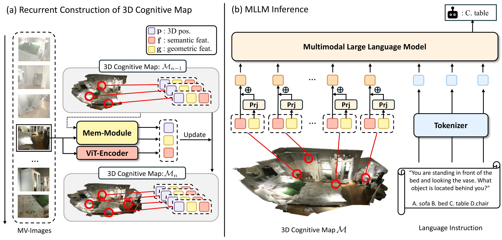

# Multi-View Vision-Language Reasoning with 3D Cognitive Maps

<div align="center" margin-bottom="3em">

[](https://arxiv.org/abs/2603.23023)
[](https://cog3dmap.github.io)
[](#)

</div>

<div align="center" margin-bottom="3em">

**Anonymous Authors**

</div>

&nbsp;

Cog3DMap constructs an explicit 3D cognitive map from multi-view images, enabling direct spatial reasoning without relying on raw video frames. Each spatial coordinate in the map carries both semantic and geometric information, which is then fed into a Multimodal Large Language Model (MLLM) for spatial question answering and grounding.

## 📰 News

* [26.06.17] Code release (tentative)

## 🧭 Overview

Multimodal large language models (MLLMs) struggle with precise spatial understanding from multi-view images. Cog3DMap addresses this by constructing an explicit **3D cognitive map** from multiple viewpoints and injecting it directly into the LLM context.

The framework:
- **Incrementally builds** a structured 3D map from multi-view images via a recurrent update.
- Maintains a **single token per spatial location** through a principled memory update that retains, refreshes, and expands tokens as new views arrive.
- Fuses **semantic features** from the MLLM vision encoder with **geometric features** from a pretrained [Point3R](https://github.com/YkiWu/Point3R) backbone, producing spatially grounded tokens that enable distance estimation, object localization, and relational reasoning.

<p align="center">
    <br>
    <figcaption align="center">Overall pipeline of Cog3DMap.</figcaption>
</p>

## 🏆 Results

Cog3DMap-8B sets new state-of-the-art on multi-view spatial reasoning benchmarks:

| Benchmark   | Score        | vs. Prior Best                |
|-------------|--------------|-------------------------------|
| VSTI-Bench  | **67.5%**    | +8.7 pp                       |
| VSI-Bench   | **65.1%**    | +3.9 pp                       |
| RoboFAC     | Competitive  | up to **−90.2%** visual tokens |

## 🛠️ Setup

1. **Clone the repository:**
    ```bash
    git clone <repo-url>
    cd Cog3DMap
    ```

2. **Create a Conda environment and install dependencies:**
    Requires **Python 3.10** and a CUDA-compatible GPU.
    ```bash
    conda create -n cog3dmap python=3.10
    conda activate cog3dmap
    pip install -e .
    ```

    > **Note:** `flash_attn` requires a matching CUDA toolchain. If the install above fails on it, install separately:
    > ```bash
    > pip install flash-attn==2.7.4.post1 --no-build-isolation
    > ```

## 🎬 Demo

For demo results, run the following:
```bash
python scripts/demo/demo_point3r.py
```

## 🗂️ Datasets

Cog3DMap is trained and evaluated on a variety of datasets:

* **Spatial Reasoning Instruction Tuning:**
    * [VLM-3R](https://github.com/VITA-Group/VLM-3R): Large-scale spatial-reasoning instruction-tuning corpus built on egocentric indoor videos. We use its VSI training split as the primary supervision source for spatial QA.
    * [SPAR-7M](https://huggingface.co/datasets/jasonzhango/SPAR-7M): A 7M-scale spatial perception and reasoning dataset. Only the **appearance-order** subset is used for training, complementing VLM-3R's coverage of temporally grounded object reference.


* **Evaluation Benchmarks:**
    * [VSI-Bench](https://huggingface.co/datasets/nyu-visionx/VSI-Bench): Evaluates the visual-spatial intelligence of MLLMs. Comprises over 5,000 QA pairs derived from 288 egocentric videos in the validation splits of three indoor 3D reconstruction datasets — ScanNet, ScanNet++, and ARKitScenes — covering eight task types (object count, absolute distance, object size, room size, relative distance, relative direction, route plan, appearance order).
    * [VSTI-Bench](https://huggingface.co/datasets/Journey9ni/vstibench): Evaluates joint **spatial and temporal** understanding across five task categories — camera-to-object absolute distance, camera displacement, camera movement, object-to-object relative pose, and camera-to-object relative distance. 
    * [RoboFAC](https://github.com/MINT-SJTU/RoboFAC/tree/main): Benchmark for comprehensive robotic **failure analysis and correction**. Evaluates models along eight criteria: task identification, failure explanation, task planning, high-level correction, low-level correction, failure detection, failure identification, and failure locating.


* **3D Scene Understanding:**
    * **3D Dense Captioning:** [Scan2Cap](https://github.com/daveredrum/Scan2Cap) — generates per-object descriptions given the 3D location of the ScanNet scenes; we use Mask3D-detected object proposals extracted from [LEO](https://github.com/embodied-generalist/embodied-generalist) for consistent region grounding.
    * **3D VQA Answering:** [ScanQA](https://github.com/ATR-DBI/ScanQA) — open-ended question answering grounded in ScanNet datasets — alongside [SQA3D](https://github.com/SilongYong/SQA3D) — Situated Question Answering in 3D Scenes.

> **Raw 3D scene data:** [ScanNet](https://github.com/ScanNet/ScanNet), [ScanNet++](https://kaldir.vc.in.tum.de/scannetpp/), and [ARKitScenes](https://github.com/apple/ARKitScenes) must be downloaded under `data/media/` so the preprocessing scripts can locate them:
> ```
> data/media/
>     scannet/
>     scannetpp/
>     arkitscenes/
> ```
> The preprocessing step (see the VSI-Bench Training Pipeline below) writes per-scene pointer memory `.pt` files under `data/media/{scannet,scannetpp,arkitscenes}/pointer_memory/`.

## 🧪 VSI-Bench Training Pipeline

End-to-end recipe for reproducing Cog3DMap-8B on VSI-Bench.

### 1. Download VLM-3R-DATA

Pull the [VLM-3R-DATA](https://huggingface.co/datasets/Journey9ni/VLM-3R-DATA) dataset into `data/`:

```bash
huggingface-cli download Journey9ni/VLM-3R-DATA \
    --repo-type dataset \
    --local-dir data/VLM-3R-DATA
```

Expected layout after download:
```
data/VLM-3R-DATA/vsibench_train/
    merged_qa_scannet_train.json
    merged_qa_route_plan_train.json
    merged_qa_scannetpp_train.json
    ...
```

### 2. Convert QA data to Cog3DMap format

Convert the train split (writes `data/train/vsibench_train_point3r.json`):

```bash
python scripts/preprocess/convert_vsibench_to_point3r.py
```

Convert the evaluation split (writes `data/evaluation/vsibench_point3r/test.json`; downloads `nyu-visionx/VSI-Bench` from HuggingFace if `--input` is not provided):

```bash
python scripts/preprocess/convert_vsibench_eval_to_point3r.py
```

### 3. Process the 3D Scenes

Generate per-scene pointer memory `.pt` files under `data/media/{scannet,scannetpp,arkitscenes}/pointer_memory/`. Each launcher fans out across the local GPUs.

* **ScanNet:**
    ```bash
    bash scripts/demo/run_preprocess_simple.sh
    ```
* **ScanNet++:**
    ```bash
    bash scripts/demo/run_preprocess_scannetpp_simple.sh
    ```
* **ARKitScenes:**
    ```bash
    bash scripts/demo/run_preprocess_arkit_simple.sh
    ```
* **RoboFAC** (only required for the RoboFAC benchmark):
    ```bash
    bash scripts/demo/run_preprocess_robofac_simple.sh
    ```

### 4. Train & Evaluate

A single SLURM script trains Qwen3-VL-8B on `vsibench_point3r` (32-frame, memory-feature fusion) and then runs `lmms-eval` on the `vsibench_point3r` benchmark using the resulting checkpoint:

```bash
sbatch scripts/run/vsibench_8b.sh
```

Outputs land at `outputs/vsibench_Qwen3VL_8b_memfeat_32frame_video`.

## ✅ Todo List

- [x] Release inference demo
- [x] Release evaluation code and preprocessing scripts
- [x] Release training scripts
- [ ] Release model weights

## 📚 Citation

Citation information will be released upon publication.

## 🙏 Acknowledgements

* This work is based on [VG-LLM](https://github.com/lavi-lab/VG-LLM) by Zheng et al. and [Point3R](https://github.com/YkiWu/Point3R) by Wu et al. We thank the authors for their open-source contribution.
* This work is also built upon [Qwen2.5-VL](https://github.com/QwenLM/Qwen2.5-VL), [Point3R](https://github.com/), and various 3D datasets including [ScanNet](https://github.com/ScanNet/ScanNet), [ScanRefer](https://github.com/daveredrum/ScanRefer), [Scan2Cap](https://github.com/daveredrum/Scan2Cap), and [EmbodiedScan](https://github.com/OpenRobotLab/EmbodiedScan).
* We thank the developers of [LMMs-Eval](https://github.com/EvolvingLMMs-Lab/lmms-eval) for their evaluation framework.
